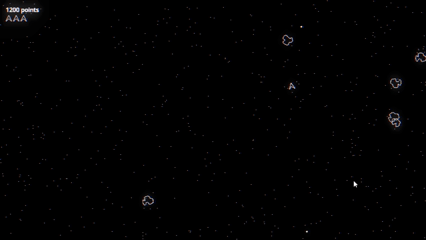

# 🪐 Asteroids+ (Godot4.x)

### 🚀 Description
A modern reimagining of the classic **Asteroids**, built with **Godot Engine 4.x**.  
Features **custom shaders**, a **dynamic power-up system**, and **improved gameplay mechanics** for a smoother, more challenging experience.

This project is part of my personal portfolio, showcasing skills in:
- Gameplay programming with **GDScript**
- **Shader** and material creation
- **UI and visual feedback** design
- **Scene organization**, signals, and 2D physics management

---

### 🖼️ Screenshots / GIFs

---

### 🎮 Main Features
- ✨ **Custom shaders** (distortion, explosion, transition, and post-processing effects)  
- ⚡ **Randomized power-ups** (speed boost, shield, fire rate, etc.)  
- 🎵 **Reactive audio** and spatial sound effects  
- 🧩 **Clean, commented, reusable code** following Godot’s best practices  

---

### 🧠 Tech Stack
- **Engine:** Godot 4.x  
- **Language:** GDScript  
- **Graphics:** Godot Shader Language (GLSL-like)  
- **Audio:** Godot AudioStreamPlayer  

---

### 🕹️ Play on Itch.io
You can play the latest version directly on Itch.io:  
👉 [**Asteroids Reimagined on Itch.io**](https://kaizzendev.itch.io/asteroids)
